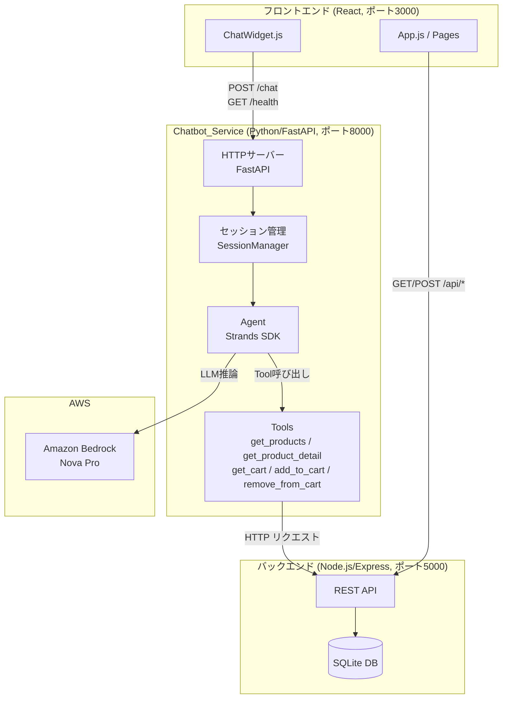
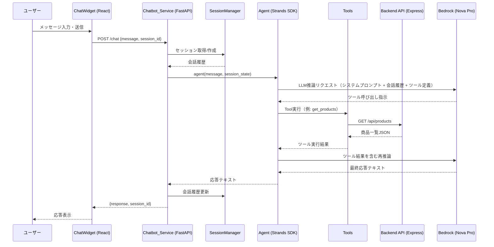
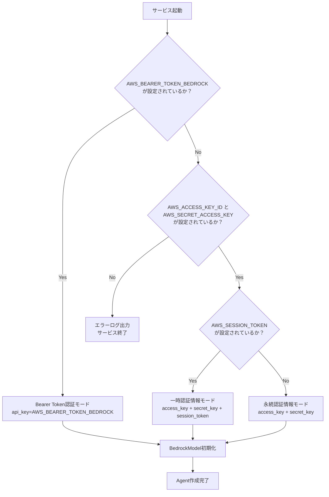

# 設計ドキュメント: ショッピングアシスタントチャットボット

## 概要

本ドキュメントは、既存のeコマースアプリケーションに統合するショッピングアシスタントチャットボットの技術設計を定義します。

チャットボットサービス（Chatbot_Service）は、Python製のStrands Agents SDKを基盤とした独立したマイクロサービスとして構築されます。Amazon Bedrock上のNova Proモデルを使用して自然言語処理を行い、既存のNode.js/Expressバックエンド（ポート5000）が提供する商品・カートAPIと連携します。フロントエンドにはポップアップ形式のChat_UIを追加し、全ページからアクセス可能にします。

### 設計方針

- **独立性**: Chatbot_Serviceは`chatbot/`ディレクトリに独立して配置し、既存サービスへの影響を最小化する
- **疎結合**: フロントエンドとChatbot_ServiceはHTTP APIで通信し、直接依存しない
- **シンプルさ**: セッション管理はインメモリのLRUキャッシュで実装し、外部ストレージ不要
- **拡張性**: Toolsモジュールを分離することで、新しいAPI連携を容易に追加できる

## アーキテクチャ

### システム全体構成



### データフロー



## コンポーネントとインターフェース

### ディレクトリ構成

```
chatbot/
├── main.py                  # エントリーポイント（FastAPIアプリ起動）
├── app/
│   ├── __init__.py
│   ├── server.py            # FastAPIアプリ定義・エンドポイント
│   ├── agent.py             # Strands Agent初期化・実行
│   ├── session.py           # セッション管理（SessionManager）
│   └── tools/
│       ├── __init__.py
│       ├── product_tools.py # 商品情報取得ツール
│       └── cart_tools.py    # カート操作ツール
├── requirements.txt         # Python依存ライブラリ
└── .env.example             # 環境変数サンプル
```

フロントエンド追加ファイル:
```
frontend/src/
└── components/
    ├── ChatWidget.js        # チャットUIコンポーネント
    └── ChatWidget.css       # チャットUIスタイル
```

### HTTPサーバー（server.py）

FastAPIを使用してHTTPサーバーを実装します。

```python
# app/server.py のインターフェース定義

# POST /chat
class ChatRequest(BaseModel):
    message: str                    # ユーザーメッセージ（必須）
    session_id: Optional[str]       # セッションID（省略時は新規生成）

class ChatResponse(BaseModel):
    response: str                   # アシスタント応答テキスト
    session_id: str                 # セッションID（新規生成時も返却）

# GET /health
class HealthResponse(BaseModel):
    status: str                     # "ok"
    service: str                    # "shopping-assistant-chatbot"
    version: str                    # "1.0.0"
```

**エンドポイント仕様:**

| メソッド | パス | 説明 | リクエスト | レスポンス |
|---------|------|------|-----------|-----------|
| POST | /chat | チャットメッセージ処理 | `{message, session_id?}` | `{response, session_id}` |
| GET | /health | ヘルスチェック | なし | `{status, service, version}` |

**エラーレスポンス:**

| HTTPステータス | 条件 | レスポンスボディ |
|--------------|------|----------------|
| 400 | `message`フィールドが欠如 | `{"detail": "messageフィールドは必須です"}` |
| 500 | Agent処理中のエラー | `{"detail": "内部サーバーエラー: {error_message}"}` |

**CORS設定:**
- 許可オリジン: `CORS_ORIGINS`環境変数（デフォルト: `http://localhost:3000`）
- 許可メソッド: `GET`, `POST`, `OPTIONS`
- 許可ヘッダー: `Content-Type`, `Authorization`

### Agentモジュール（agent.py）

Strands Agents SDKを使用してAgentを初期化・実行します。

```python
# app/agent.py のインターフェース定義

def create_agent() -> Agent:
    """
    Strands AgentをNova Proモデルで初期化する。
    AWS認証情報を環境変数から読み込み、BedrockModelを設定する。
    
    Returns:
        Agent: 初期化済みのStrands Agent
    
    Raises:
        EnvironmentError: 必須のAWS認証情報が設定されていない場合
    """

def run_agent(agent: Agent, message: str, conversation_history: list) -> str:
    """
    Agentにメッセージを送信し、応答テキストを返す。
    
    Args:
        agent: 初期化済みのStrands Agent
        message: ユーザーメッセージ
        conversation_history: 過去の会話履歴リスト
    
    Returns:
        str: アシスタントの応答テキスト
    
    Raises:
        RuntimeError: Agent実行中にエラーが発生した場合
    """
```

**Bedrockモデル設定:**

```python
MODEL_ID = "amazon.nova-pro-v1:0"
AWS_REGION = os.environ.get("AWS_REGION", "us-east-1")
```

**システムプロンプト:**

```
あなたはeコマースストアのショッピングアシスタントです。
日本語で丁寧かつ自然な会話を行い、お客様のショッピングをサポートします。

あなたの役割:
- 商品の検索・推薦（カテゴリ、価格帯、用途に基づく）
- 商品の詳細情報の提供（価格、説明、レビュー）
- カートの管理（追加・確認・削除）
- ショッピングに関する質問への回答

重要なルール:
- 常に日本語で応答してください
- ショッピングと無関係なトピックには丁重に対応し、ショッピング支援に誘導してください
- カートへの追加前に、商品名と数量をユーザーに確認してください
- 商品IDが不明な場合は、まずget_productsで商品一覧を取得してください
- 金額は日本円（¥）で表示してください
```

**AWS認証情報の設定フロー:**



### セッション管理（session.py）

`collections.OrderedDict`を使用したLRUキャッシュ方式でセッションを管理します。

```python
# app/session.py のインターフェース定義

class SessionManager:
    """
    会話セッションをインメモリで管理するクラス。
    OrderedDictを使用したLRUキャッシュ方式で最大セッション数を制限する。
    """
    
    def __init__(self, max_sessions: int = 100):
        """
        Args:
            max_sessions: 保持する最大セッション数（デフォルト: 100）
        """
    
    def get_or_create_session(self, session_id: Optional[str]) -> tuple[str, list]:
        """
        セッションIDに対応する会話履歴を取得する。
        session_idがNoneまたは存在しない場合は新規セッションを作成する。
        
        Args:
            session_id: セッションID（省略可）
        
        Returns:
            tuple[str, list]: (session_id, conversation_history)
        """
    
    def update_session(self, session_id: str, user_message: str, assistant_response: str) -> None:
        """
        セッションの会話履歴にメッセージペアを追加する。
        セッションをOrderedDictの末尾（最近使用）に移動する。
        
        Args:
            session_id: セッションID
            user_message: ユーザーメッセージ
            assistant_response: アシスタント応答
        """
    
    def _evict_oldest(self) -> None:
        """
        セッション数が上限を超えた場合、最も古いセッションを削除する（LRU方式）。
        """
```

**セッションデータ構造:**

```python
# セッションストアの内部構造
sessions: OrderedDict[str, list] = OrderedDict()

# 会話履歴の各エントリ
conversation_entry = {
    "role": "user" | "assistant",
    "content": str  # メッセージテキスト
}
```

**LRUキャッシュの動作:**
1. セッションアクセス時にOrderedDictの末尾に移動（`move_to_end`）
2. セッション数が`max_sessions`を超えた場合、先頭（最も古い）セッションを削除
3. スレッドセーフ性のため`threading.Lock`で排他制御

### Toolsモジュール

#### 商品情報ツール（product_tools.py）

```python
# app/tools/product_tools.py

@tool
def get_products() -> str:
    """
    eコマースストアの全商品一覧を取得します。
    商品の検索や推薦に使用してください。
    
    Returns:
        str: 商品一覧のJSON文字列
             各商品: {id, name, category, price, description, emoji}
             エラー時: {"error": "エラーメッセージ"}
    """

@tool
def get_product_detail(product_id: int) -> str:
    """
    指定した商品IDの詳細情報を取得します。
    商品の詳細説明、価格、レビューを確認する際に使用してください。
    
    Args:
        product_id: 商品ID（整数）
    
    Returns:
        str: 商品詳細のJSON文字列
             {id, name, category, price, description, emoji, reviews: [...]}
             エラー時: {"error": "エラーメッセージ"}
    """
```

#### カート操作ツール（cart_tools.py）

```python
# app/tools/cart_tools.py

@tool
def get_cart() -> str:
    """
    現在のカート内容を取得します。
    カートの確認や合計金額の計算に使用してください。
    
    Returns:
        str: カートアイテム一覧のJSON文字列
             各アイテム: {id, product_id, name, price, quantity, emoji}
             エラー時: {"error": "エラーメッセージ"}
    """

@tool
def add_to_cart(product_id: int, quantity: int) -> str:
    """
    指定した商品をカートに追加します。
    ユーザーに商品名と数量を確認してから呼び出してください。
    
    Args:
        product_id: 商品ID（整数）
        quantity: 追加する数量（1以上の整数）
    
    Returns:
        str: 操作結果のJSON文字列
             成功時: {"message": "カートに追加しました", "id": cart_item_id}
             エラー時: {"error": "エラーメッセージ"}
    """

@tool
def remove_from_cart(cart_item_id: int) -> str:
    """
    指定したカートアイテムIDの商品をカートから削除します。
    削除前にget_cartでカートアイテムIDを確認してください。
    
    Args:
        cart_item_id: カートアイテムID（整数、商品IDではない）
    
    Returns:
        str: 操作結果のJSON文字列
             成功時: {"message": "カートから削除しました"}
             エラー時: {"error": "エラーメッセージ"}
    """
```

**Tool共通実装パターン:**

```python
import os
import requests

BACKEND_API_URL = os.environ.get("BACKEND_API_URL", "http://localhost:5000")

def _call_backend(method: str, path: str, **kwargs) -> dict:
    """バックエンドAPIを呼び出す共通関数"""
    url = f"{BACKEND_API_URL}{path}"
    try:
        response = requests.request(method, url, timeout=10, **kwargs)
        response.raise_for_status()
        return response.json()
    except requests.exceptions.ConnectionError:
        return {"error": "バックエンドサービスに接続できません"}
    except requests.exceptions.Timeout:
        return {"error": "バックエンドサービスがタイムアウトしました"}
    except requests.exceptions.HTTPError as e:
        return {"error": f"APIエラー: {e.response.status_code}"}
    except Exception as e:
        return {"error": f"予期しないエラー: {str(e)}"}
```

## データモデル

### APIリクエスト/レスポンス

```python
# POST /chat リクエスト
{
    "message": "おすすめの商品を教えてください",  # 必須
    "session_id": "abc123"                        # 省略可（省略時は新規生成）
}

# POST /chat レスポンス
{
    "response": "こんにちは！当店のおすすめ商品をご紹介します...",
    "session_id": "abc123"
}

# GET /health レスポンス
{
    "status": "ok",
    "service": "shopping-assistant-chatbot",
    "version": "1.0.0"
}
```

### セッションストア

```python
# インメモリセッションストア（OrderedDict）
sessions = OrderedDict({
    "session_id_1": [
        {"role": "user", "content": "おすすめの商品は？"},
        {"role": "assistant", "content": "以下の商品がおすすめです..."}
    ],
    "session_id_2": [
        {"role": "user", "content": "カートを見せて"},
        {"role": "assistant", "content": "現在のカートには..."}
    ]
})
```

### バックエンドAPIレスポンス（参照）

```python
# GET /api/products レスポンス（各商品）
{
    "id": 1,
    "name": "商品名",
    "category": "カテゴリ",
    "price": 1000,
    "description": "商品説明",
    "emoji": "🛍️"
}

# GET /api/cart レスポンス（各カートアイテム）
{
    "id": 1,           # カートアイテムID（remove_from_cartで使用）
    "product_id": 2,   # 商品ID
    "name": "商品名",
    "price": 1000,
    "quantity": 2,
    "emoji": "🛍️"
}
```

### フロントエンド状態管理

```javascript
// ChatWidget.js の状態
const [isOpen, setIsOpen] = useState(false);          // チャットウィンドウ開閉
const [messages, setMessages] = useState([]);          // 表示用メッセージ履歴
const [inputValue, setInputValue] = useState('');      // 入力フィールド値
const [isLoading, setIsLoading] = useState(false);     // ローディング状態

// メッセージオブジェクト
{
    id: Date.now(),           // 一意ID
    role: 'user' | 'assistant',
    content: 'メッセージテキスト',
    timestamp: new Date()
}

// セッションID（sessionStorage）
sessionStorage.getItem('chatbot_session_id')
sessionStorage.setItem('chatbot_session_id', session_id)
```

## エラーハンドリング

### Chatbot_Serviceのエラー処理

| エラー種別 | 発生箇所 | 処理方法 | ユーザーへの通知 |
|-----------|---------|---------|----------------|
| 必須環境変数未設定 | サービス起動時 | ログ出力後にプロセス終了 | なし（起動失敗） |
| Bedrock接続エラー | Agent実行時 | 例外キャッチ → HTTP 500 | エラーメッセージ返却 |
| バックエンドAPI接続エラー | Tool実行時 | エラーJSONをAgentに返却 | Agentが日本語で説明 |
| バックエンドAPIタイムアウト | Tool実行時 | エラーJSONをAgentに返却 | Agentが日本語で説明 |
| 不正なリクエストボディ | エンドポイント受信時 | HTTP 400返却 | エラーメッセージ返却 |
| セッション管理エラー | セッション操作時 | 新規セッション作成にフォールバック | 透過的（ユーザーに見えない） |

### フロントエンドのエラー処理

| エラー種別 | 処理方法 | UI表示 |
|-----------|---------|--------|
| Chatbot_Service接続失敗 | fetch catch | 「接続エラーが発生しました」メッセージ表示 |
| HTTP 400エラー | レスポンス確認 | 「メッセージを入力してください」表示 |
| HTTP 500エラー | レスポンス確認 | 「サービスエラーが発生しました」表示 |
| ネットワークタイムアウト | AbortController | 「応答がタイムアウトしました」表示 |

### バックエンド未起動時の動作

要件8.4に基づき、バックエンドが利用不可の場合でもChatbot_Serviceは起動を継続します。

```
ユーザー: 商品を見せて
Agent: [get_productsツール呼び出し]
Tool: {"error": "バックエンドサービスに接続できません"}
Agent: 申し訳ありません。現在商品情報を取得できない状態です。
       しばらく時間をおいてから再度お試しください。
```

## フロントエンドコンポーネント設計

### ChatWidget.js

```jsx
// frontend/src/components/ChatWidget.js

import React, { useState, useEffect, useRef } from 'react';
import './ChatWidget.css';

const CHATBOT_URL = process.env.REACT_APP_CHATBOT_URL || 'http://localhost:8000';
const SESSION_KEY = 'chatbot_session_id';

function ChatWidget() {
    const [isOpen, setIsOpen] = useState(false);
    const [messages, setMessages] = useState([
        {
            id: 0,
            role: 'assistant',
            content: 'こんにちは！ショッピングアシスタントです。商品の検索やカートの管理をお手伝いします。',
            timestamp: new Date()
        }
    ]);
    const [inputValue, setInputValue] = useState('');
    const [isLoading, setIsLoading] = useState(false);
    const messagesEndRef = useRef(null);

    // メッセージ追加時に自動スクロール
    useEffect(() => {
        messagesEndRef.current?.scrollIntoView({ behavior: 'smooth' });
    }, [messages]);

    const sendMessage = async () => {
        if (!inputValue.trim() || isLoading) return;

        const userMessage = inputValue.trim();
        const sessionId = sessionStorage.getItem(SESSION_KEY);

        // ユーザーメッセージを即時表示
        setMessages(prev => [...prev, {
            id: Date.now(),
            role: 'user',
            content: userMessage,
            timestamp: new Date()
        }]);
        setInputValue('');
        setIsLoading(true);

        try {
            const controller = new AbortController();
            const timeoutId = setTimeout(() => controller.abort(), 30000);

            const response = await fetch(`${CHATBOT_URL}/chat`, {
                method: 'POST',
                headers: { 'Content-Type': 'application/json' },
                body: JSON.stringify({ message: userMessage, session_id: sessionId }),
                signal: controller.signal
            });
            clearTimeout(timeoutId);

            if (!response.ok) {
                throw new Error(`HTTP ${response.status}`);
            }

            const data = await response.json();
            sessionStorage.setItem(SESSION_KEY, data.session_id);

            setMessages(prev => [...prev, {
                id: Date.now(),
                role: 'assistant',
                content: data.response,
                timestamp: new Date()
            }]);
        } catch (error) {
            const errorMsg = error.name === 'AbortError'
                ? '応答がタイムアウトしました。再度お試しください。'
                : 'エラーが発生しました。しばらく時間をおいてから再度お試しください。';
            setMessages(prev => [...prev, {
                id: Date.now(),
                role: 'error',
                content: errorMsg,
                timestamp: new Date()
            }]);
        } finally {
            setIsLoading(false);
        }
    };

    const handleKeyDown = (e) => {
        if (e.key === 'Enter' && !e.shiftKey) {
            e.preventDefault();
            sendMessage();
        }
    };

    return (
        <div className="chat-widget">
            {/* フローティングボタン */}
            <button
                className={`chat-toggle-btn ${isOpen ? 'open' : ''}`}
                onClick={() => setIsOpen(!isOpen)}
                aria-label={isOpen ? 'チャットを閉じる' : 'チャットを開く'}
            >
                {isOpen ? '✕' : '💬'}
            </button>

            {/* チャットウィンドウ */}
            {isOpen && (
                <div className="chat-window" role="dialog" aria-label="ショッピングアシスタント">
                    <div className="chat-header">
                        <span className="chat-header-icon">🛒</span>
                        <span className="chat-header-title">ショッピングアシスタント</span>
                        <button
                            className="chat-close-btn"
                            onClick={() => setIsOpen(false)}
                            aria-label="閉じる"
                        >
                            ✕
                        </button>
                    </div>

                    <div className="chat-messages" role="log" aria-live="polite">
                        {messages.map(msg => (
                            <div key={msg.id} className={`message message-${msg.role}`}>
                                <div className="message-content">{msg.content}</div>
                            </div>
                        ))}
                        {isLoading && (
                            <div className="message message-assistant">
                                <div className="message-content loading-indicator">
                                    <span></span><span></span><span></span>
                                </div>
                            </div>
                        )}
                        <div ref={messagesEndRef} />
                    </div>

                    <div className="chat-input-area">
                        <textarea
                            className="chat-input"
                            value={inputValue}
                            onChange={e => setInputValue(e.target.value)}
                            onKeyDown={handleKeyDown}
                            placeholder="メッセージを入力... (Enterで送信)"
                            rows={1}
                            disabled={isLoading}
                            aria-label="メッセージ入力"
                        />
                        <button
                            className="chat-send-btn"
                            onClick={sendMessage}
                            disabled={!inputValue.trim() || isLoading}
                            aria-label="送信"
                        >
                            ➤
                        </button>
                    </div>
                </div>
            )}
        </div>
    );
}

export default ChatWidget;
```

### ChatWidget.css（主要スタイル）

```css
/* frontend/src/components/ChatWidget.css */

/* フローティングボタン */
.chat-toggle-btn {
    position: fixed;
    bottom: 24px;
    right: 24px;
    width: 56px;
    height: 56px;
    border-radius: 50%;
    background-color: #2563eb;
    color: white;
    border: none;
    font-size: 24px;
    cursor: pointer;
    box-shadow: 0 4px 12px rgba(0, 0, 0, 0.2);
    z-index: 1000;
    transition: transform 0.2s, background-color 0.2s;
}

.chat-toggle-btn:hover {
    background-color: #1d4ed8;
    transform: scale(1.05);
}

/* チャットウィンドウ */
.chat-window {
    position: fixed;
    bottom: 92px;
    right: 24px;
    width: 360px;
    height: 520px;
    background: white;
    border-radius: 16px;
    box-shadow: 0 8px 32px rgba(0, 0, 0, 0.15);
    display: flex;
    flex-direction: column;
    z-index: 999;
    overflow: hidden;
}

/* ヘッダー */
.chat-header {
    background-color: #2563eb;
    color: white;
    padding: 12px 16px;
    display: flex;
    align-items: center;
    gap: 8px;
}

/* メッセージエリア */
.chat-messages {
    flex: 1;
    overflow-y: auto;
    padding: 16px;
    display: flex;
    flex-direction: column;
    gap: 8px;
}

/* メッセージバブル */
.message-user .message-content {
    background-color: #2563eb;
    color: white;
    margin-left: auto;
    border-radius: 16px 16px 4px 16px;
}

.message-assistant .message-content {
    background-color: #f3f4f6;
    color: #111827;
    margin-right: auto;
    border-radius: 16px 16px 16px 4px;
}

.message-error .message-content {
    background-color: #fee2e2;
    color: #dc2626;
    border-radius: 8px;
}

.message-content {
    padding: 10px 14px;
    max-width: 80%;
    font-size: 14px;
    line-height: 1.5;
    white-space: pre-wrap;
    word-break: break-word;
}

/* ローディングインジケーター（3点アニメーション） */
.loading-indicator {
    display: flex;
    gap: 4px;
    padding: 12px 16px;
}

.loading-indicator span {
    width: 8px;
    height: 8px;
    background-color: #9ca3af;
    border-radius: 50%;
    animation: bounce 1.2s infinite;
}

.loading-indicator span:nth-child(2) { animation-delay: 0.2s; }
.loading-indicator span:nth-child(3) { animation-delay: 0.4s; }

@keyframes bounce {
    0%, 80%, 100% { transform: translateY(0); }
    40% { transform: translateY(-6px); }
}

/* 入力エリア */
.chat-input-area {
    padding: 12px;
    border-top: 1px solid #e5e7eb;
    display: flex;
    gap: 8px;
    align-items: flex-end;
}

.chat-input {
    flex: 1;
    border: 1px solid #d1d5db;
    border-radius: 8px;
    padding: 8px 12px;
    font-size: 14px;
    resize: none;
    outline: none;
    font-family: inherit;
}

.chat-input:focus {
    border-color: #2563eb;
}

.chat-send-btn {
    background-color: #2563eb;
    color: white;
    border: none;
    border-radius: 8px;
    width: 36px;
    height: 36px;
    cursor: pointer;
    font-size: 16px;
    transition: background-color 0.2s;
}

.chat-send-btn:disabled {
    background-color: #9ca3af;
    cursor: not-allowed;
}
```

### App.jsへの統合

```jsx
// frontend/src/App.js への追加

import ChatWidget from './components/ChatWidget';

function App() {
    // ... 既存のコード ...
    
    return (
        <Router>
            <div className="App">
                {/* 既存のヘッダー・メイン・フッター */}
                
                {/* 全ページに表示されるチャットウィジェット */}
                <ChatWidget />
            </div>
        </Router>
    );
}
```

## 正確性プロパティ

*プロパティとは、システムの全ての有効な実行において成立すべき特性または動作のことです。つまり、システムが何をすべきかについての形式的な記述です。プロパティは人間が読める仕様と機械で検証可能な正確性保証の橋渡しをします。*

本機能では、以下のコンポーネントがProperty-Based Testing（PBT）に適しています：
- **セッション管理（SessionManager）**: 純粋なデータ構造操作で、任意のsession_idとメッセージで動作が定義される
- **Tool関数のURL生成**: 任意の整数IDに対して決定的なURL生成ロジックをテストできる
- **フロントエンドのsessionStorage操作**: 任意のsession_id文字列に対して決定的な保存・取得動作をテストできる

LLMの応答品質（要件6）やAgentのツール選択（要件4.3, 4.4, 5.4-5.6）はLLMの非決定的な動作に依存するため、PBTではなく統合テストで検証します。

使用するPBTライブラリ: **Hypothesis**（Python）、**@fast-check/jest**（JavaScript/React）

### Property 1: セッション履歴の保存と取得の一貫性

*For any* session_id（文字列）と任意の数のメッセージペア（ユーザーメッセージ、アシスタント応答）に対して、`update_session`で追加した後に`get_or_create_session`で取得した会話履歴は、追加した全てのメッセージペアを正しい順序で含んでいなければならない。

**Validates: Requirements 3.1, 3.3**

### Property 2: LRUキャッシュの上限管理

*For any* 最大セッション数N（1以上の整数）と、N+k個（k >= 1）のセッションに対して、SessionManagerにN+k個のセッションを追加した後のセッション総数はN以下でなければならない。また、最後にアクセスされたN個のセッションは保持されていなければならない。

**Validates: Requirements 3.5**

### Property 3: get_product_detail のURL生成

*For any* 正の整数product_idに対して、`get_product_detail(product_id)`はバックエンドAPIの`/api/products/{product_id}`エンドポイントに対してGETリクエストを送信しなければならない。

**Validates: Requirements 4.2**

### Property 4: add_to_cart のリクエスト生成

*For any* 正の整数product_idと正の整数quantityに対して、`add_to_cart(product_id, quantity)`はバックエンドAPIの`/api/cart`エンドポイントに対して`{"product_id": product_id, "quantity": quantity}`のボディでPOSTリクエストを送信しなければならない。

**Validates: Requirements 5.2**

### Property 5: remove_from_cart のURL生成

*For any* 正の整数cart_item_idに対して、`remove_from_cart(cart_item_id)`はバックエンドAPIの`/api/cart/{cart_item_id}`エンドポイントに対してDELETEリクエストを送信しなければならない。

**Validates: Requirements 5.3**

### Property 6: フロントエンドのsession_id永続化

*For any* 有効なsession_id文字列に対して、Chatbot_Serviceからのレスポンスを受信した後、`sessionStorage.getItem('chatbot_session_id')`は受信したsession_idと同じ値を返さなければならない。

**Validates: Requirements 7.8**

## テスト戦略

### テストアプローチ

本機能では、以下の3層のテスト戦略を採用します：

1. **Unit Tests（単体テスト）**: 個別のコンポーネント・関数の動作を検証
2. **Property-Based Tests（プロパティベーステスト）**: 普遍的な性質を多数の生成入力で検証
3. **Integration Tests（統合テスト）**: コンポーネント間の連携とエンドツーエンドのフローを検証

### テストスコープ

#### Chatbot_Service（Python）

**Unit Tests:**
- `app/server.py`: エンドポイントハンドラーのリクエスト/レスポンス処理
  - POST /chat: 有効なリクエストで200レスポンス
  - POST /chat: messageフィールド欠如で400エラー
  - GET /health: ヘルスチェックレスポンス
  - CORS設定の確認
- `app/agent.py`: Agent初期化とAWS認証情報設定
  - 環境変数からのAWS認証情報読み込み
  - Bearer Token認証モードの切り替え
  - 必須環境変数欠如時のEnvironmentError
- `app/session.py`: SessionManagerの基本動作
  - 新規セッション生成
  - 既存セッション取得
  - セッションIDがNoneの場合の新規生成
- `app/tools/product_tools.py`: 商品情報ツールのエラーハンドリング
  - バックエンドAPI接続エラー時のエラーオブジェクト返却
  - タイムアウト時のエラーオブジェクト返却
- `app/tools/cart_tools.py`: カート操作ツールのエラーハンドリング
  - バックエンドAPI接続エラー時のエラーオブジェクト返却

**Property-Based Tests（Hypothesis使用、各テスト100+ iterations）:**
- `app/session.py`: SessionManager
  - **Property 1**: セッション履歴の保存と取得の一貫性
    - Tag: `Feature: shopping-assistant-chatbot, Property 1: セッション履歴の保存と取得の一貫性`
  - **Property 2**: LRUキャッシュの上限管理
    - Tag: `Feature: shopping-assistant-chatbot, Property 2: LRUキャッシュの上限管理`
- `app/tools/product_tools.py`: get_product_detail
  - **Property 3**: get_product_detail のURL生成
    - Tag: `Feature: shopping-assistant-chatbot, Property 3: get_product_detail のURL生成`
- `app/tools/cart_tools.py`: add_to_cart, remove_from_cart
  - **Property 4**: add_to_cart のリクエスト生成
    - Tag: `Feature: shopping-assistant-chatbot, Property 4: add_to_cart のリクエスト生成`
  - **Property 5**: remove_from_cart のURL生成
    - Tag: `Feature: shopping-assistant-chatbot, Property 5: remove_from_cart のURL生成`

**Integration Tests:**
- Agent + Tools + モックバックエンド
  - 商品検索リクエストでget_productsが呼び出される
  - 商品詳細リクエストでget_product_detailが呼び出される
  - カート追加リクエストでadd_to_cartが呼び出される
- Agent + Bedrock（実際のAPI呼び出し、CI/CDでは環境変数設定時のみ実行）
  - 日本語メッセージに対する日本語応答
  - ショッピング外トピックへの適切な誘導

#### Frontend（React）

**Unit Tests（React Testing Library + Jest）:**
- `components/ChatWidget.js`: コンポーネントレンダリング
  - フローティングボタンの表示
  - ボタンクリック時のチャットウィンドウ表示
  - メッセージ入力フィールド、送信ボタン、会話履歴エリアの存在
  - ユーザーメッセージとアシスタント応答の視覚的区別（CSSクラス）
  - ローディングインジケーターの表示（fetch中）
  - エラーメッセージの表示（fetch失敗時）
- `components/ChatWidget.js`: メッセージ送信フロー（fetchモック）
  - メッセージ送信後にPOST /chatが呼び出される
  - レスポンス受信後に応答が会話履歴に追加される
  - 空メッセージの送信が無効化される

**Property-Based Tests（@fast-check/jest使用、各テスト100+ iterations）:**
- `components/ChatWidget.js`: sessionStorage操作
  - **Property 6**: フロントエンドのsession_id永続化
    - Tag: `Feature: shopping-assistant-chatbot, Property 6: フロントエンドのsession_id永続化`

**Integration Tests（Cypress または Playwright）:**
- エンドツーエンドフロー
  - ホームページでチャットボタンをクリック → チャットウィンドウ表示
  - メッセージ送信 → 応答受信 → 会話履歴に表示
  - 商品ページでチャットボタンをクリック → 同じセッションが維持される
  - カートページでチャットボタンをクリック → 同じセッションが維持される

### テストツールとライブラリ

**Python（Chatbot_Service）:**
- **pytest**: テストランナー
- **pytest-asyncio**: 非同期テストサポート
- **Hypothesis**: Property-Based Testing
- **httpx**: HTTPクライアント（テスト用）
- **pytest-mock**: モッキング
- **responses**: HTTPリクエストのモック

**JavaScript/React（Frontend）:**
- **Jest**: テストランナー
- **React Testing Library**: Reactコンポーネントテスト
- **@fast-check/jest**: Property-Based Testing
- **@testing-library/user-event**: ユーザーインタラクションシミュレーション
- **Cypress** または **Playwright**: E2Eテスト

### テスト実行コマンド

```bash
# Chatbot_Service
cd chatbot
pytest tests/ -v                          # 全テスト実行
pytest tests/ -v -m "not integration"     # 統合テスト除外
pytest tests/ -v -k "property"            # プロパティテストのみ

# Frontend
cd frontend
npm test                                  # 全テスト実行
npm test -- --testNamePattern="property"  # プロパティテストのみ
npm run test:e2e                          # E2Eテスト実行
```

### CI/CDでのテスト実行

- **Pull Request時**: Unit Tests + Property-Based Tests（統合テスト除外）
- **main/masterマージ時**: 全テスト実行（統合テスト含む、AWS認証情報設定時のみBedrock統合テスト実行）
- **Property-Based Tests**: 各テスト最低100 iterations実行

## 依存ライブラリ

### chatbot/requirements.txt

```
# Webフレームワーク
fastapi==0.115.5
uvicorn[standard]==0.32.1

# Strands Agents SDK
strands-agents==0.1.7
strands-agents-tools==0.1.7

# AWS SDK
boto3==1.35.76
botocore==1.35.76

# HTTPクライアント（Tool内でバックエンドAPI呼び出し）
requests==2.32.3

# 環境変数管理
python-dotenv==1.0.1

# テスト
pytest==8.3.4
pytest-asyncio==0.24.0
pytest-mock==3.14.0
hypothesis==6.119.3
httpx==0.28.0
responses==0.25.3
```

### フロントエンド追加依存（package.json）

```json
{
  "devDependencies": {
    "@fast-check/jest": "^0.1.1"
  }
}
```

注: React Testing LibraryとJestはcreate-react-appに含まれているため追加不要。

### chatbot/.env.example

```bash
# AWS認証情報（通常認証）
AWS_ACCESS_KEY_ID=your_access_key_id
AWS_SECRET_ACCESS_KEY=your_secret_access_key
AWS_REGION=us-east-1

# AWS認証情報（一時認証、オプション）
# AWS_SESSION_TOKEN=your_session_token

# AWS Bedrock Bearer Token認証（通常認証の代替）
# AWS_BEARER_TOKEN_BEDROCK=your_bearer_token

# サービス設定
CHATBOT_PORT=8000
BACKEND_API_URL=http://localhost:5000

# CORS設定
CORS_ORIGINS=http://localhost:3000
```

## 実装上の注意事項

### Strands Agents SDKの使用方法

```python
# Strands Agents SDKの基本的な使用パターン
from strands import Agent, tool
from strands.models import BedrockModel

# BedrockModelの初期化（通常認証）
model = BedrockModel(
    model_id="amazon.nova-pro-v1:0",
    region_name=AWS_REGION,
    aws_access_key_id=AWS_ACCESS_KEY_ID,
    aws_secret_access_key=AWS_SECRET_ACCESS_KEY,
    aws_session_token=AWS_SESSION_TOKEN  # オプション
)

# BedrockModelの初期化（Bearer Token認証）
model = BedrockModel(
    model_id="amazon.nova-pro-v1:0",
    region_name=AWS_REGION,
    api_key=AWS_BEARER_TOKEN_BEDROCK
)

# Agentの作成
agent = Agent(
    model=model,
    system_prompt=SYSTEM_PROMPT,
    tools=[get_products, get_product_detail, get_cart, add_to_cart, remove_from_cart]
)

# Agentの実行（会話履歴付き）
response = agent(
    message,
    # Strands SDKのセッション管理機能を使用するか、
    # または会話履歴をmessagesパラメータで渡す
)
```

### スレッドセーフティ

FastAPIは非同期フレームワークですが、SessionManagerはスレッドセーフに実装する必要があります。`threading.Lock`を使用して排他制御を行います。

```python
import threading
from collections import OrderedDict

class SessionManager:
    def __init__(self, max_sessions: int = 100):
        self._sessions: OrderedDict = OrderedDict()
        self._lock = threading.Lock()
        self._max_sessions = max_sessions
    
    def get_or_create_session(self, session_id):
        with self._lock:
            # セッション操作
            ...
```

### フロントエンドのChatbot_Service URL設定

フロントエンドはReactのproxyを使用してバックエンドAPIにアクセスしていますが、Chatbot_Serviceは別ポート（8000）で動作するため、直接URLを指定します。

```javascript
// 環境変数で設定可能（.env.local）
// REACT_APP_CHATBOT_URL=http://localhost:8000
const CHATBOT_URL = process.env.REACT_APP_CHATBOT_URL || 'http://localhost:8000';
```

本番環境では、リバースプロキシ（nginx等）を使用してChatbot_ServiceへのリクエストをプロキシするかCORSを適切に設定することを推奨します。
